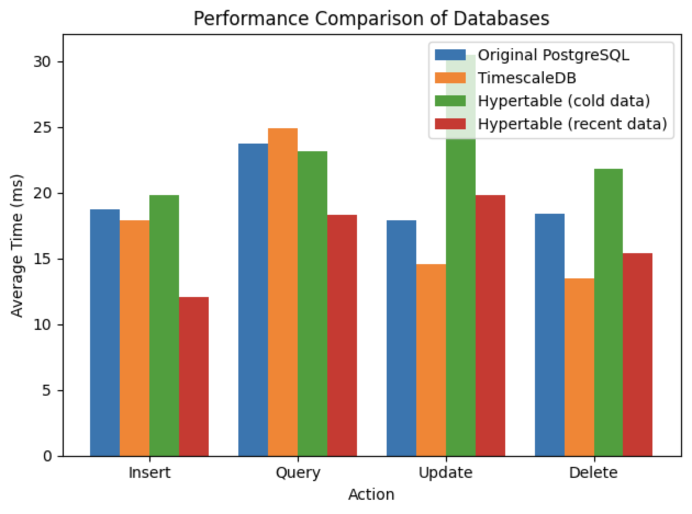
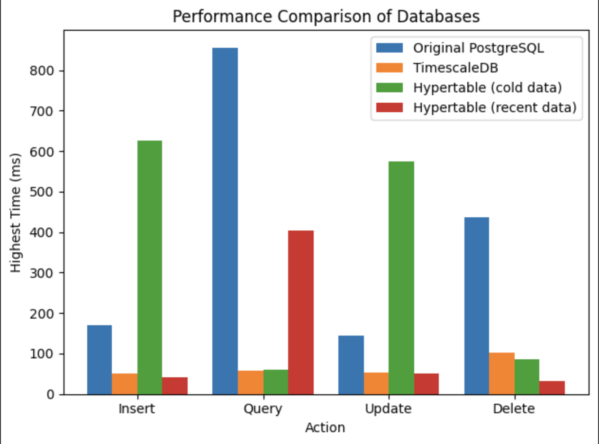
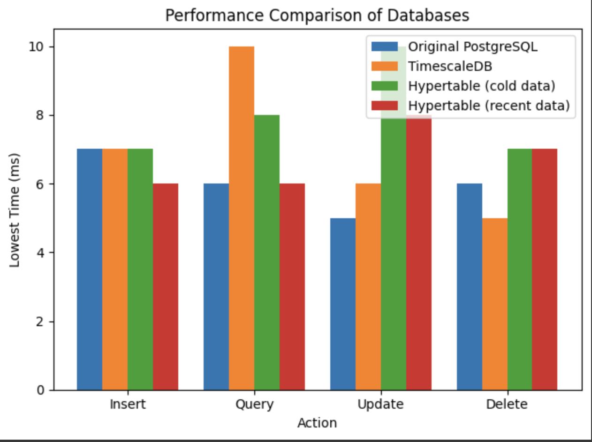

# Test Results

## Introduction

1. Postgres version: PostgreSQL16

2. `0.61 million rows` in the test table.

3. Request `100 times` per test

4. do `Create, Read, Update, Delete` 4 actions

## Result

(Highest/average/lowest) time (unit: ms) of each test

| Action | Original PostgresSQL | TimescaleDB     | TimescaleDB with Hypertable(cold data) | TimescaleDB with Hypertable(recent data) |
| ------ | -------------------- | --------------- | -------------------------------------- | ---------------------------------------- |
| Insert | 171 / 18.73 / 7      | 50 / 17.89 / 7  | 627 / 19.86 / 7                        | 42 / 12.08 / 6                           |
| Query  | 856 / 23.77 / 6      | 58 / 24.93 / 10 | 61 / 23.17 /8                          | 404 / 18.35 / 6                          |
| Update | 144 / 17.88 / 5      | 53 / 14.61 / 6  | 575 / 30.53 / 10                       | 51 / 19.83 /8                            |
| Delete | 436 / 18.37 / 6      | 102 / 13.48 / 5 | 85 / 21.82 / 7                         | 33 / 15.41 / 7                           |

### Bar Chart

#### Average Time

#### Highest Time

#### Lowest Time

## Conclusion

The performance of PostgreSQL and TimescaleDB varies significantly across different actions (Insert, Query, Update, Delete) and configurations. Here’s a detailed analysis based on the test results:

  - PostgreSQL generally has higher peak times across all actions, indicating potential inefficiencies in handling initial operations.
  - TimescaleDB provides more consistent and lower peak times, showing better performance for most operations. For example, TimescaleDB’s average insert time is about 5% faster and its peak insert time is 71% lower than PostgreSQL.
  - TimescaleDB with Hypertable (cold data) exhibits performance degradation, especially for Insert and Update actions, suggesting inefficiencies with cold data. Its peak insert time is 266% higher and its average update time is 71% higher than PostgreSQL.
  - TimescaleDB with Hypertable (recent data) demonstrates the best performance, particularly for Insert and Query actions. Its average query time is about 23% faster and its peak insert time is 75% lower than PostgreSQL.
 
- Key Observation:
  The peak times recorded for all configurations occurred during the first request of each test. This suggests that initial operations incur the highest latency due to cold start effects, initial cache loading, or other initialization processes. Subsequent requests benefit from warmed caches and optimized execution paths, resulting in significantly lower times.

Overall, TimescaleDB, especially with Hypertables optimized for recent data, offers superior performance for most operations compared to traditional PostgreSQL. This makes it a more suitable choice for applications requiring efficient handling of time-series data and recent transactions.
