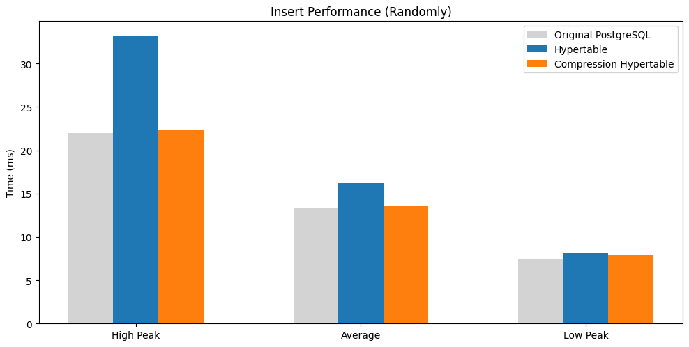
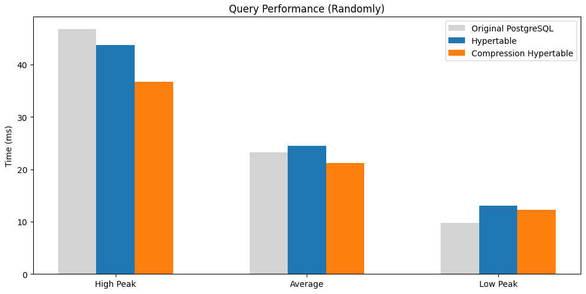
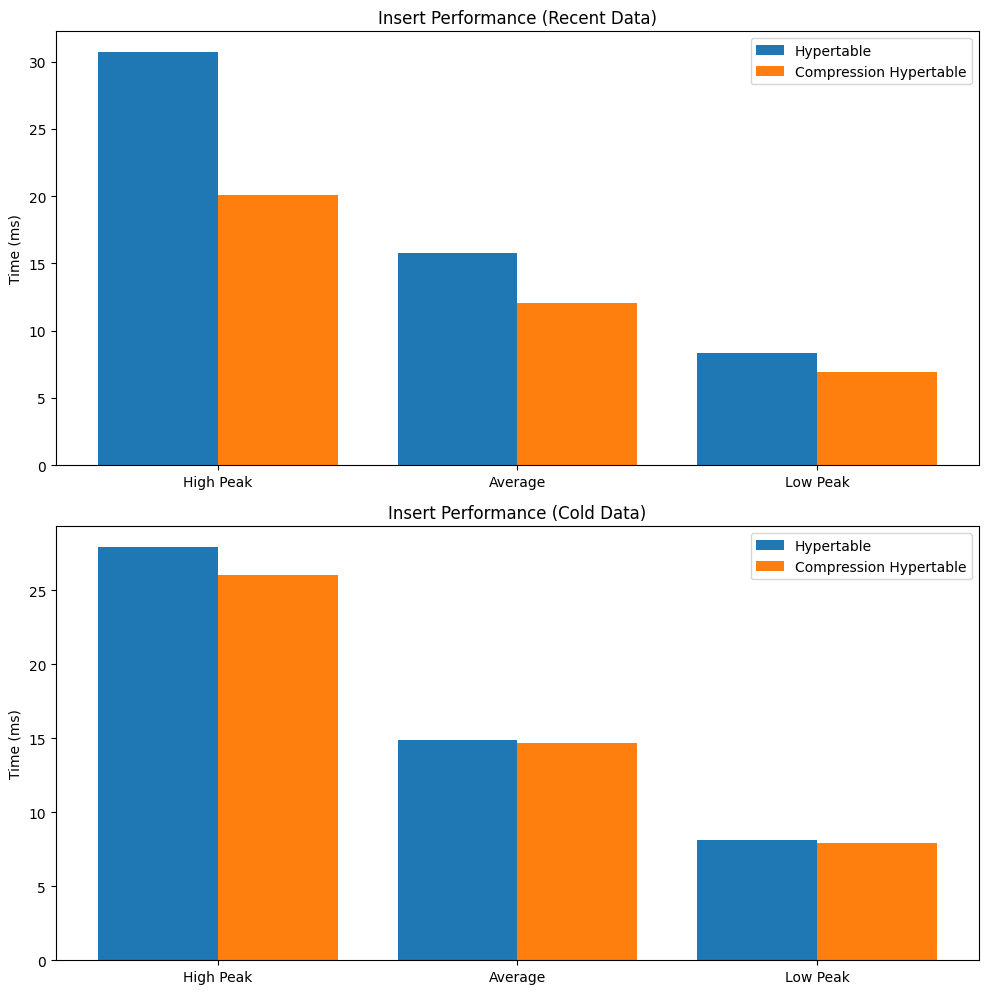
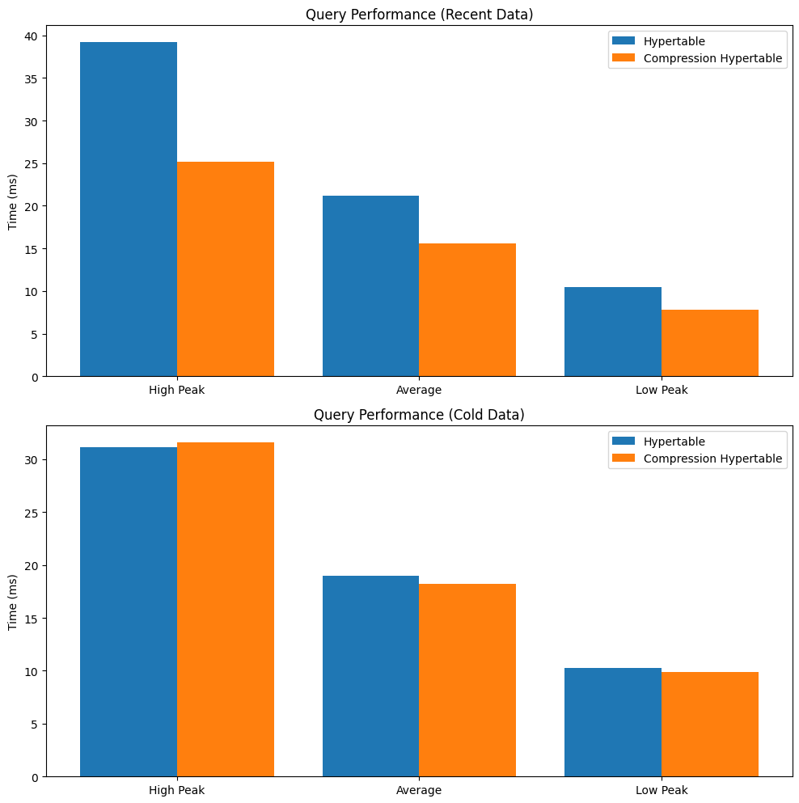
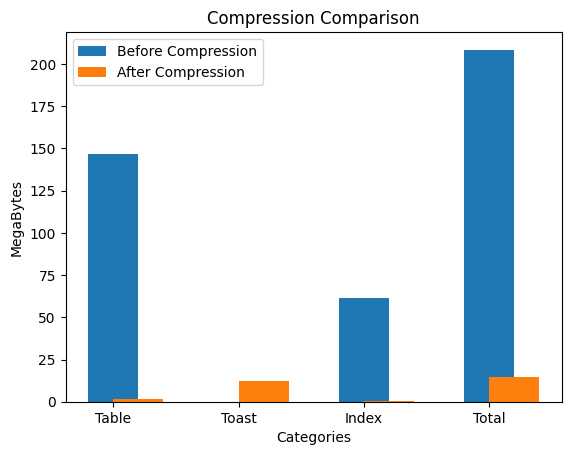

# TimescaleDB Performance Test

## Summary

The performance tests were conducted on PostgreSQL 16 with three different table configurations: **`traditional PostgreSQL tables, hypertables, and hypertables with compression`**. The tests involved 1.01 million rows in the test table and **`10,000 requests per test`**, focusing on **`both insert and query operations`**. The performance metrics were evaluated based on high peak, average, and low peak times.

## Background and Definitions

1. Environment: PostgreSQL16.
2. `1.01 million rows` in the test table, without an index on the time column.
3. High peak: average time of first 20% data, after descending sort.
4. Average: total average time.
5. Low peak: average time of last 20% data, after descending sort.
6. Recent data: data in the first 3 chunks.
7. Cold data: data over the first 3 chunks.

## Methods

1. Each test consisted of 10,000 requests.
2. Tests involved **`Create (Insert) and Read (Query)`** operations on the created_at column, used for partitioning in hypertable.

## Result

### Operate randomly at traditional table, hypertable, compressed hypertable

#### Insert operation

|           | Original PostgresSQL | Hypertable | Compressed Hypertable |
| --------- | -------------------- | ---------- | --------------------- |
| High Peak | 22.0 ms              | 33.24 ms   | 22.38 ms              |
| Average   | 13.26 ms             | 16.15 ms   | 13.57 ms              |
| Low Peak  | 7.45 ms              | 8.15 ms    | 7.9 ms                |

 
&nbsp;&nbsp;&nbsp;&nbsp;&nbsp;&nbsp;&nbsp;&nbsp;*Lower is better.

 

- The high peak times for inserts were highest for hypertables without compression (33.24 ms), followed by compressed hypertables (22.38 ms), and traditional PostgreSQL tables (22.0 ms).
- On average, the traditional PostgreSQL table performed the best (13.26 ms), closely followed by compressed hypertables (13.57 ms). Hypertables without compression lagged slightly behind (16.15 ms).
- The low peak times were relatively close across all configurations, with traditional PostgreSQL tables (7.45 ms) slightly outperforming the other two configurations.

#### Query operation on created_at column

|           | Original PostgresSQL | Hypertable | Compression Hypertable |
| --------- | -------------------- | ---------- | ---------------------- |
| High Peak | 46.76 ms             | 43.66 ms   | 36.65 ms               |
| Average   | 23.17 ms             | 24.49 ms   | 21.18 ms               |
| Low Peak  | 9.74 ms              | 13.0 ms    | 12.24 ms               |

 
  &nbsp;&nbsp;&nbsp;&nbsp;&nbsp;&nbsp;&nbsp;&nbsp;*Lower is better.

 

- For query operations, the high peak times were highest for traditional PostgreSQL tables (46.76 ms), while compressed hypertables showed the best performance (36.65 ms).
- On average, compressed hypertables performed the best (21.18 ms), with traditional PostgreSQL tables (23.17 ms) and hypertables without compression (24.49 ms) following.
- The low peak times were best for traditional PostgreSQL tables (9.74 ms), with compressed hypertables (12.24 ms) and hypertables without compression (13.0 ms) following behind.

### Operating data on hypertable and compressed hypertable

#### Insert operation at

- Cold data

  |           | Hypertable | Compressed Hypertable |
  | --------- | ---------- | --------------------- |
  | High Peak | 27.91 ms   | 26.04 ms              |
  | Average   | 14.88 ms   | 14.69 ms              |
  | Low Peak  | 8.1 ms     | 7.89 ms               |

- Recent data

  |           | Hypertable | Compressed Hypertable |
  | --------- | ---------- | --------------------- |
  | High Peak | 30.71 ms   | 20.07 ms              |
  | Average   | 15.8 ms    | 12.09 ms              |
  | Low Peak  | 8.36 ms    | 6.93 ms               |

 
  &nbsp;&nbsp;&nbsp;&nbsp;&nbsp;&nbsp;&nbsp;&nbsp;*Lower is better.

 

#### Query operation on created_at column at

- Cold data

  |           | Hypertable | Compression Hypertable |
  | --------- | ---------- | ---------------------- |
  | High Peak | 31.16 ms   | 31.6 ms                |
  | Average   | 19.0 ms    | 18.2 ms                |
  | Low Peak  | 10.26 ms   | 9.9 ms                 |

- Recent data

  |           | Hypertable | Compression Hypertable |
  | --------- | ---------- | ---------------------- |
  | High Peak | 39.21 ms   | 25.17 ms               |
  | Average   | 21.21 ms   | 15.56 ms               |
  | Low Peak  | 10.49 ms   | 7.78 ms                |

 
  &nbsp;&nbsp;&nbsp;&nbsp;&nbsp;&nbsp;&nbsp;&nbsp;*Lower is better.

 

Insert Operations:

- When dealing with cold data, both hypertables with and without compression had similar performance, with compressed hypertables slightly better on high peak and average times.
- For recent data, compressed hypertables outperformed non-compressed hypertables in both high peak and average times.

Query Operations:

- With cold data, compressed hypertables and non-compressed hypertables performed similarly.
- For recent data, compressed hypertables outperformed non-compressed hypertables significantly in high peak and average times.

#### Space Usage Comparison

- Unit: MegaByte (MB)

  | Category | Before Compression | After Compression | After/Before Ratio |
  | -------- | ------------------ | ----------------- | ------------------ |
  | Table    | 146.76             | 1.81              | 1.24%              |
  | Toast    | 0                  | 12.31             | -                  |
  | Index    | 61.66              | 0.56              | 0.91%              |
  | Total    | 208.42             | 14.69             | 7.05%              |

The compression significantly reduced space usage across all categories. The table size reduced from 146.76 MB to 1.81 MB (**`1.24% of the original size`**), and the total size reduced from 208.42 MB to 14.69 MB (**`7.05% of the original size`**).

## Conclusion

In summary, for random insert and query actions, traditional PostgreSQL tables and compressed hypertables generally offer better performance than non-compressed hypertables. **`Compressed hypertables provide a good balance of performance and storage efficiency`**, making them a suitable choice for scenarios where both read and write performance are critical, along with reduced storage requirements. **`Notably, the space usage after compression was reduced to just 7.05% of the original size`**, highlighting the significant storage savings achieved through compression.
